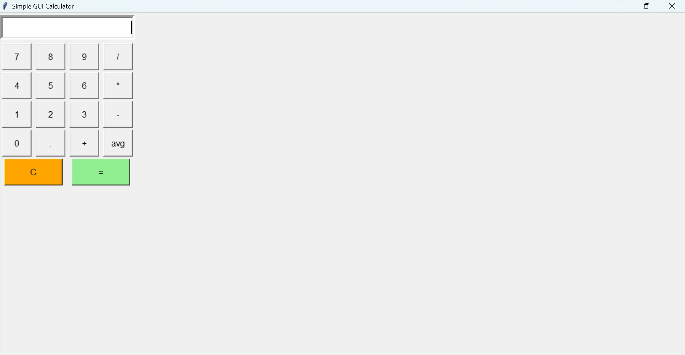

# Calculator App

## Screenshot

A Python GUI calculator built with Tkinter that performs basic arithmetic operations.

## Features

* Addition
* Subtraction
* Multiplication
* Division
* Simple and user-friendly interface

## Technologies Used

* Python
* Tkinter

## How to Run

1. Install Python.
2. Run the Python file.
3. Use the calculator interface to perform calculations.

## Author

Subrat Dubey
